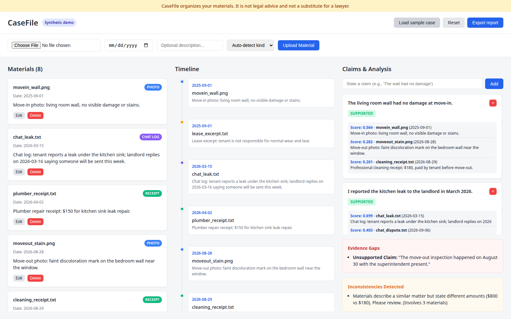
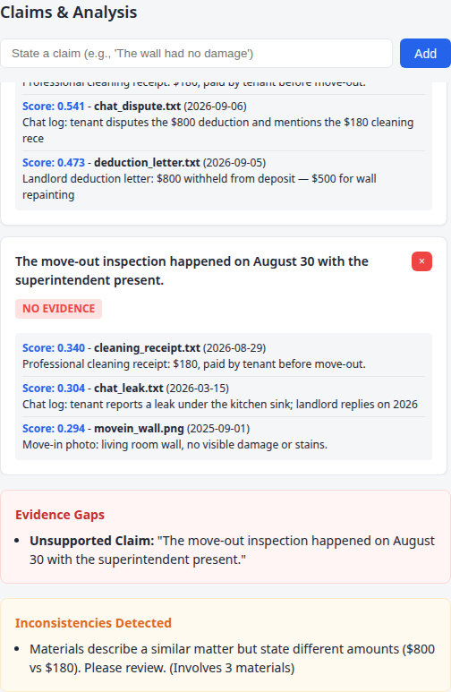

# dispute-evidence-builder
**CaseFile — Dispute Evidence Builder**

Turn a messy pile of dispute materials (photos, chat logs, receipts, documents) into a chronological evidence timeline, check every claim against the evidence with semantic matching, and surface gaps and contradictions — then export a clean evidence brief.

> **Synthetic demo data:** every name, address, amount and document in the sample case is fictional and generated for demonstration.
> **Not legal advice:** CaseFile organizes your materials. It is not legal advice and not a substitute for a lawyer.



## Why this exists

Consumer AI tools will happily "review" your documents, but they silently miss things: a claim with zero supporting evidence looks the same as a well-supported one, and two documents stating different dollar amounts never get cross-checked. CaseFile is built around the opposite idea — **every claim must cite its evidence, and anything unsupported or contradictory is flagged, not hidden.**

What a plain LLM chat cannot do here:
1. **Temporal normalization** — photo EXIF dates, "March 15" in a chat log and receipt dates are aligned onto one timeline.
2. **Gap detection** — a claim with no supporting material is explicitly surfaced instead of failing silently.
3. **Cross-document amount checks** — deterministic clustering finds materials describing the same matter with conflicting amounts.

## Features

- **Upload & auto-extract** — photos (EXIF date), chat logs, receipts and PDFs; dates and `$` amounts extracted automatically.
- **Chronological timeline** — kind-colored, click any entry for the full source text.
- **Claim–evidence matching** — sentence-transformer embeddings + cosine similarity; each claim is graded **Supported / Partial / No evidence** with cited materials and scores.
- **Evidence gaps** — unsupported claims and undated materials listed in one panel.
- **Inconsistency detection** — deterministic topic clustering flags materials stating conflicting amounts (e.g. a $180 cleaning receipt vs a $300 cleaning charge).
- **Evidence brief export** — standalone print-friendly HTML report (timeline + claims + gaps + inconsistencies).

## Quickstart

```bash
pip install -r backend/requirements.txt
cd backend
uvicorn app:app --port 8000
```

Then open `frontend/index.html` in your browser. The frontend talks to the API at `http://127.0.0.1:8000`.

## Sample case walkthrough

Click **Load sample case** — a fictional Toronto security-deposit dispute (tenant Alex Morgan vs Northline Properties, 1200 Fictional Ave):

| # | Material | Date | What it shows |
|---|----------|------|---------------|
| 1 | movein_wall.png (photo) | 2025-09-01 | Wall clean at move-in |
| 2 | chat_leak.txt (chat) | 2026-03-15 | Tenant reports kitchen leak |
| 3 | plumber_receipt.txt (receipt) | 2026-04-02 | $150 leak repair |
| 4 | moveout_stain.png (photo) | 2026-08-28 | Faint wall stain at move-out |
| 5 | cleaning_receipt.txt (receipt) | 2026-08-29 | Tenant paid $180 for cleaning |
| 6 | deduction_letter.txt (document) | 2026-09-05 | Landlord withholds $800 ($500 repaint + $300 cleaning) |
| 7 | lease_excerpt.txt (document) | 2025-09-01 | "Normal wear and tear" clause |
| 8 | chat_dispute.txt (chat) | 2026-09-06 | Tenant disputes the deduction |

Five claims are pre-registered. Watch what happens:
- *"The landlord withheld $800 from my deposit."* → **Supported**, cited to the deduction letter.
- *"I paid $180 for professional cleaning before moving out."* → **Supported** — and the **Inconsistencies** panel flags the $180 receipt vs the $300 cleaning charge.
- *"The move-out inspection happened on August 30 with the superintendent present."* → **No evidence** — honestly surfaced in the **Evidence Gaps** panel: the deduction letter mentions an inspection after departure, but no material records a joint inspection on August 30 with the superintendent.

Then click **Export report** for the printable brief.



## Tech stack

- Backend: Python, FastAPI, uvicorn, python-multipart
- ML: sentence-transformers (`all-MiniLM-L6-v2`), numpy cosine similarity
- File processing: Pillow (EXIF), pypdf
- Frontend: vanilla HTML/CSS/JS, no build step
- Storage: in-memory (demo scope)

## Project status

A self-directed learning project. All data is synthetic; the app organizes materials and does not provide legal advice.

## License

MIT — see [LICENSE](LICENSE).
